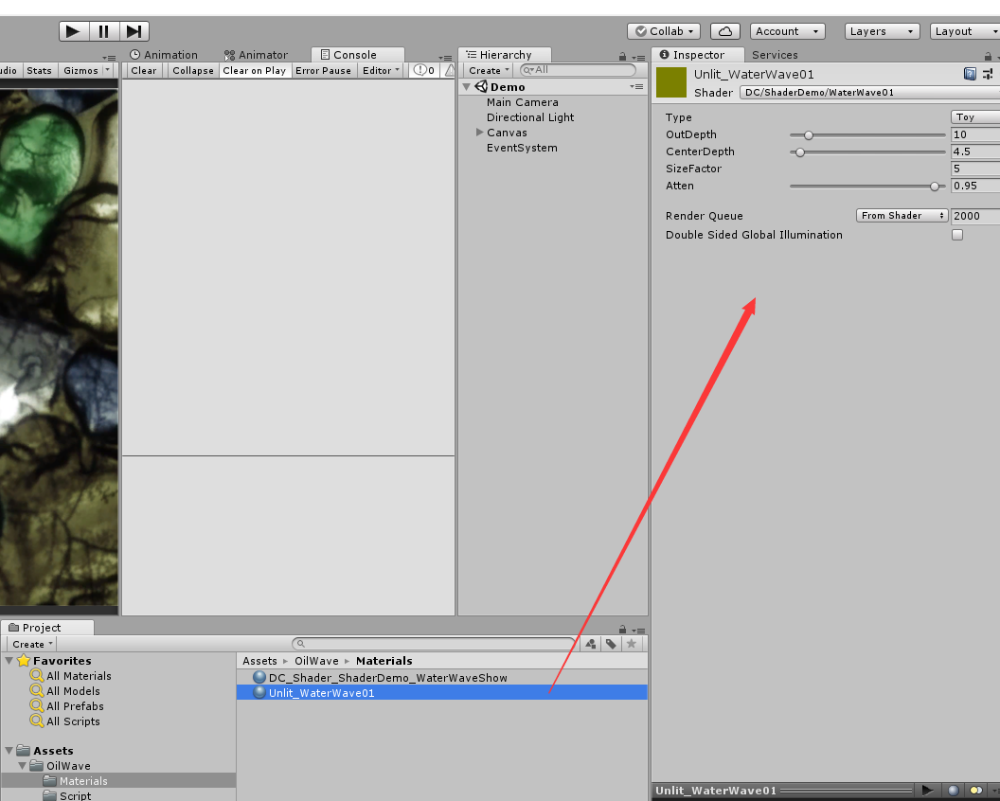

# 1.0
## 文件说明
- OilWavePostProcessing
  - 屏幕后处理类
- WaterWave01.shader
  - 波纹传播计算，调参数主要是调使用这个shader的材质
- WaterWaveShow
  - 波纹偏移计算

## 要改的材质和参数

## 参数说明
- Type
  - Toy：使用shader toy上的公式
  - Classic：使用经典波纹传播公式
- OutDepth：远离波纹中心的振幅
- CenterDepth：接近波纹中心的振幅
- SizeFactor：越大波纹越小，反之越大
- Atten：衰减速度，越小波纹时间越短，反之越久

# 2.0 根据设置的目标分辨率和材质创建特效
- 打开工程中的demo，可以看到有设置分辨率的入口

## DemoForResolutionAdapt
- 演示用的demo，参照着写接入的部分

## ResolutionManager
- 根据分辨率创建可用的用于存储波纹的纹理